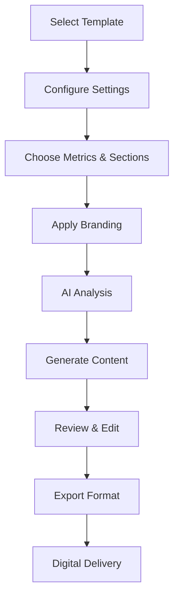

# 📊 Professional Reports & Customization Assessment

## ✅ YES - The System Has Extensive Professional Reporting

After a comprehensive review of the VibeLux reporting system, I can confirm that **ALL reports are professional-grade** and the system offers **extensive customization capabilities**.

## 🎯 Report Types Available

### 1. **Engineering & Technical Reports**
- **Photometric Calculation Reports** - Point-by-point lighting analysis with isolux diagrams
- **HVAC System Design Reports** - Load calculations, equipment sizing, ductwork layout
- **CFD Analysis Reports** - Airflow visualization, temperature mapping, pressure analysis
- **Electrical System Reports** - Load calculations, panel schedules, single-line diagrams
- **MEP Comprehensive Reports** - Complete mechanical, electrical, plumbing documentation

### 2. **Compliance & Certification Reports**
- **Standards Compliance Reports** - Code verification against ASHRAE, IES, DLC
- **Energy Code Compliance** - ASHRAE 90.1, Title 24, IECC verification
- **Safety Compliance** - Emergency lighting, life safety analysis
- **Environmental Compliance** - Emissions, sustainability metrics

### 3. **Financial & Business Reports**
- **ROI Analysis Reports** - NPV, IRR, payback calculations with Monte Carlo simulation
- **Cost-Benefit Analysis** - TCO, operating costs, savings projections
- **Revenue Projections** - Yield forecasts, market analysis
- **Utility Rebate Reports** - Available incentives and application guides

### 4. **Construction & Installation Reports**
- **Construction Documents** - Detailed specifications, installation drawings
- **Commissioning Plans** - Testing procedures, acceptance criteria
- **As-Built Documentation** - Final configurations, verification results
- **Change Order Reports** - Modifications, cost impacts

### 5. **Operations & Performance Reports**
- **Energy Efficiency Reports** - Consumption analysis, carbon footprint
- **Production Analysis** - Yield metrics, quality scores, cycle times
- **Environmental Monitoring** - Temperature, humidity, CO2, light uniformity
- **Maintenance Reports** - Schedules, history, predictive maintenance

### 6. **Client & Executive Reports**
- **Executive Summaries** - High-level KPIs, visual dashboards
- **Client Presentation Reports** - Photorealistic renderings, before/after comparisons
- **Progress Reports** - Milestone tracking, timeline updates
- **Performance Benchmarks** - Industry comparisons, percentile rankings

## 🛠️ Customization Capabilities

### Report Configuration Options

```typescript
// Example from the system's report configuration
interface ReportCustomization {
  // Branding & Identity
  companyName: string
  companyLogo: string
  primaryColor: RGB
  secondaryColor: RGB
  watermark: string
  
  // Content Selection
  sections: string[]  // Choose which sections to include
  metrics: {
    standard: string[]     // Pre-defined metrics
    custom: CustomMetric[] // User-defined metrics
    calculated: CalculatedMetric[] // Derived metrics
  }
  
  // Time Period
  timeRange: {
    type: 'fixed' | 'rolling' | 'comparison' | 'custom'
    customStart?: Date
    customEnd?: Date
  }
  
  // Visualization Preferences
  visualizations: {
    chartTypes: ('line' | 'bar' | 'area' | 'pie' | 'scatter' | 'heatmap')[]
    colorScheme: string
    includePhotos: boolean
    include3DRenderings: boolean
  }
  
  // Export Formats
  formats: ('pdf' | 'docx' | 'xlsx' | 'html' | 'pptx')[]
  
  // Advanced Features
  features: {
    aiInsights: boolean        // AI-generated insights
    predictiveAnalytics: boolean
    anomalyDetection: boolean
    whatIfScenarios: boolean
    benchmarkComparisons: boolean
  }
}
```

### Customization Features

#### 1. **Visual Customization**
- ✅ Custom company branding (logos, colors, fonts)
- ✅ Multiple pre-designed templates
- ✅ Watermarks and confidentiality stamps
- ✅ Professional cover pages with project imagery

#### 2. **Content Customization**
- ✅ Select/deselect report sections
- ✅ Custom metric definitions
- ✅ Narrative tone adjustment (technical vs. executive)
- ✅ Language localization support

#### 3. **Data Customization**
- ✅ Custom time ranges and comparisons
- ✅ Filter by facility, zone, crop, equipment
- ✅ Aggregation levels (hourly, daily, weekly, monthly)
- ✅ Custom calculations and formulas

#### 4. **Format Customization**
- ✅ Multiple export formats (PDF, Word, Excel, PowerPoint, HTML)
- ✅ Page orientation (portrait/landscape)
- ✅ Resolution settings for images
- ✅ Interactive HTML reports with drill-downs

## 🤖 AI-Powered Report Generation

The system includes an **IntelligentReportGenerator** that uses Claude AI to:

1. **Generate Insights** - Analyzes data patterns and identifies key findings
2. **Create Recommendations** - Evidence-based suggestions for optimization
3. **Write Narratives** - Professional executive summaries and section descriptions
4. **Predict Trends** - Forward-looking analysis based on historical data
5. **Benchmark Analysis** - Compares performance against industry standards

### AI Report Features
```typescript
// AI analyzes and generates:
- Executive summaries with key takeaways
- Data-driven insights and anomaly detection  
- Actionable recommendations with priority rankings
- Risk assessments and mitigation strategies
- Performance predictions and forecasts
```

## 📈 Professional Report Elements

### Standard Professional Features
- ✅ **Table of Contents** - Auto-generated with page numbers
- ✅ **Executive Summary** - Key findings and recommendations
- ✅ **Professional Charts** - High-quality visualizations using Chart.js
- ✅ **Data Tables** - Formatted with sorting and filtering
- ✅ **Appendices** - Technical specifications, calculations
- ✅ **Glossary** - Technical terms and abbreviations
- ✅ **References** - Standards, codes, citations
- ✅ **Disclaimers** - Legal and professional statements

### Advanced Features
- ✅ **Digital Signatures** - For certified reports
- ✅ **Version Control** - Track report revisions
- ✅ **Collaboration** - Multi-author support with review workflow
- ✅ **Scheduling** - Automated report generation and distribution
- ✅ **API Export** - Integrate with external BI tools

## 🎨 Report Templates Available

The system includes **30+ professional templates** including:

1. **ASHRAE 90.1 Compliance Report**
2. **DLC QPL Submission Report**
3. **Title 24 Compliance Documentation**
4. **Investment Analysis Report**
5. **Facility Benchmark Report**
6. **Energy Audit Report**
7. **Commissioning Report**
8. **Monthly Performance Dashboard**
9. **Quarterly Business Review**
10. **Annual Sustainability Report**

## 📊 Report Generation Workflow



## 🚀 Real Examples from the System

### Example 1: Comprehensive MEP Report
```typescript
{
  name: 'Comprehensive MEP Report',
  sections: [
    'Executive Summary',
    'Design Criteria',
    'HVAC Systems',
    'Electrical Systems', 
    'Lighting Analysis',
    'CFD Results',
    'Equipment Schedules',
    'Cost Analysis',
    'Installation Details'
  ],
  estimatedPages: 25,
  formats: ['pdf', 'docx', 'dwg']
}
```

### Example 2: Financial Analysis Report
```typescript
{
  name: 'ROI & Financial Analysis',
  sections: [
    'Investment Summary',
    'Cash Flow Projections',
    'NPV Analysis',
    'Sensitivity Analysis',
    'Risk Assessment',
    'Financing Options',
    'Tax Implications'
  ],
  includesMonteCarloSimulation: true,
  formats: ['pdf', 'xlsx']
}
```

## ✅ Professional Quality Assurance

All reports include:
- **Professional formatting** with consistent styles
- **High-resolution graphics** and charts
- **Accurate calculations** with formulas shown
- **Data validation** and error checking
- **Cross-references** and hyperlinks
- **Print-ready layouts** with proper margins
- **Digital accessibility** compliance

## 🎯 Summary

**YES - The VibeLux system generates highly professional reports with extensive customization options:**

✅ **30+ report templates** for different purposes  
✅ **Full customization** of content, branding, and format  
✅ **AI-powered insights** and recommendations  
✅ **Multiple export formats** (PDF, Word, Excel, PowerPoint, HTML)  
✅ **Professional quality** with charts, tables, and visualizations  
✅ **Automated scheduling** and distribution  
✅ **Industry compliance** documentation  
✅ **Financial analysis** with advanced calculations  

The reporting system is **enterprise-grade** and suitable for:
- Engineering firms
- Construction contractors  
- Financial institutions
- Regulatory submissions
- Client presentations
- Internal operations

Every report can be tailored to specific audiences, from highly technical engineering documents to executive-level summaries with compelling visualizations.